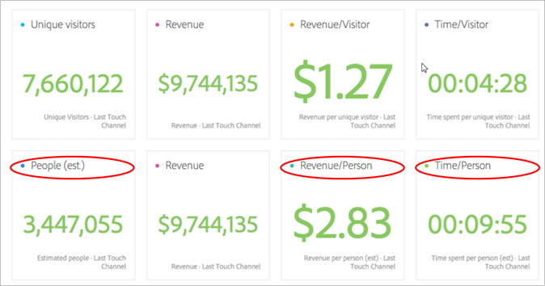
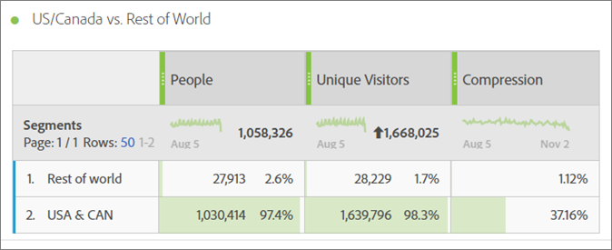
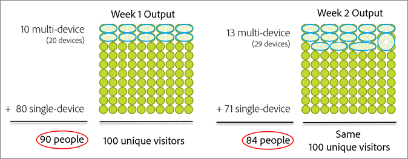
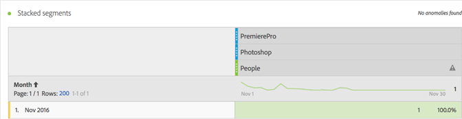
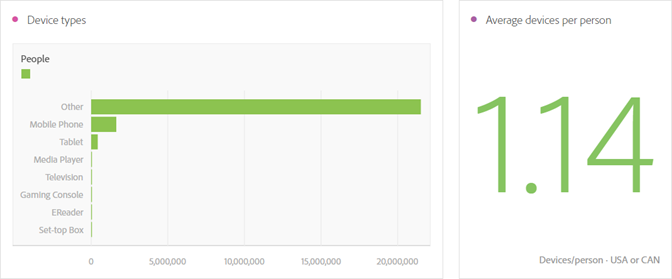
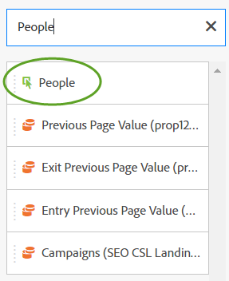

# Metrik für Personen{#people-metric}

Die Metrik &quot;Personen&quot;ist die Anzahl der Personen (oder Gerätegruppen), die auf dem Gerätediagramm der Adobe basieren. Sie können die Metrik &quot;Personen&quot;anwenden, um Besucher geräteübergreifend in Analysis Workspace zu identifizieren.

## Voraussetzungen und Erwägungen für Metriken für Personen {#section-34551d0435fb4b3cb3fad736b7961541}

<table id="table_120F7EF50042485391E58B22DD00A2A8"> 
 <thead> 
  <tr> 
   <th colname="col1" class="entry"> Voraussetzung oder Erwägung </th> 
   <th colname="col2" class="entry"> Beschreibung </th> 
  </tr>
 </thead>
 <tbody> 
  <tr> 
   <td colname="col1"> 
Device Co-op 
 </td> 
   <td colname="col2"> 
 Um die Metrik "Personen"zu verwenden, müssen Sie Mitglied der <a href="http://landing.adobe.com/en/na/events/summit/275658-summit-co-op.html" format="html" scope="external"> Adobe Experience Cloud Device Co-op</a> werden. Die Kooperation identifiziert die verschiedenen Geräte (oder Experience Cloud-IDs) einer Person. Analytics nutzt diese Informationen, um die Anzahl der Personen, die mit einer Marke interagieren, statistisch abzuleiten. Die Metrik ist auf maximal 5 % genau. 
 
<b>Regionen</b>: Die Device Co-op ist derzeit nur in den USA und Kanada verfügbar. Daher sollten Sie bei der Auswertung der Metrik "Personen"ein Segment auf Ihre Analyse anwenden, das Ihre Daten nur für die USA und Kanada Filter. 
 
Das Gerätediagramm berechnet jede Woche eine neue Version des Co-op und veröffentlicht sie zur Verwendung. Am Dienstag sammelt das System die neuesten Daten und veröffentlicht eine aktualisierte Version des Diagramms. Experience Cloud-Lösungen verwenden dann die neueste Version des Diagramms. Speziell für Analytics werden die Änderungen mittwochs gelesen und die Verarbeitung dauert in der Regel zwischen 1 und 2 Werktagen. 
 
 
Wichtig:  Wenn das Diagramm wöchentlich aktualisiert wird, kann dies historische Auswirkungen auf die Metrik "Personen"haben. Mit anderen Worten, die Zählung historischer Personen kann sich mit der Zeit ändern, während das Diagramm lernt und aktualisiert wird. Wenn Sie beispielsweise heute einen Bericht ausführen, der "Personen im letzten Monat"zählt, und dann in einer Woche nach der Aktualisierung des Diagramms denselben Bericht ausführen, kann sich die Anzahl der historischen "Personen"geringfügig ändern. 
 
 </td> 
  </tr> 
  <tr> 
   <td colname="col1"> Metrikberechtigungen </td> 
   <td colname="col2"> 
Sie können die Metrik "Personen"nur verwenden, wenn Ihnen Zugriff darauf gewährt wurde. Administratoren können in den Admin Tools Metrikberechtigungen</a> anpassen.
 </td> 
  </tr> 
  <tr> 
   <td colname="col1"> Zuordnung zu IMS-Org </td> 
   <td colname="col2"> 
Die Metrik für Personen wird für alle Report Suites aktiviert, die <a href="https://docs.adobe.com/content/help/de-DE/core-services/interface/about-core-services/report-suite-mapping.html" format="html" scope="external"> einem IMSORG</a> zugeordnet sind. 
 </td> 
  </tr> 
  <tr> 
   <td colname="col1"> 
Analyse Projekte/Tools 
 </td> 
   <td colname="col2"> 
Verwenden Sie die Metrik "Personen"in  Analysis Workspace,  Ad Hoc Analysis,  Report Builder und über die API. Sie können sie überall dort verwenden, wo Sie die Metrik "Individuelle Besucher"verwenden würden, einschließlich berechneter Metriken. 
 
Erstellen Sie beispielsweise eine Metrik "Umsatz pro Person", um eine Metrik "Umsatz pro individuellem Besucher"zu ersetzen. 
 
Für die ersten Schritte mit der Metrik "Personen"in Analysis Workspace steht eine <a href="https://docs.adobe.com/content/help/de-DE/analytics/analyze/analysis-workspace/build-workspace-project/starter-projects.html" format="html" scope="external">-Projektvorlage "Personen"zur Verfügung.</a> 
 </td> 
  </tr> 
  <tr> 
   <td colname="col1"> 
Bot-Regeln aktivieren 
 </td> 
   <td colname="col2"> 
Adobe empfiehlt, dass Sie <a href="https://docs.adobe.com/content/help/en/analytics/admin/admin-tools/bot-removal/bot-rules.html" format="html" scope="external"> Bot Rules</a> aktivieren, insbesondere bei Verwendung der Metrik "Personen". 
 
Wenn ein Bot Ihre Website durchsucht, erhöht dies künstlich die Anzahl der individuellen Besucher. Die Entfernung des Bot-Traffics aus Ihrer Report Suite bietet eine genauere Messung der Aktivität Ihrer digitalen Eigenschaften, sowohl im Hinblick auf individuelle Besucher als auch auf Personen. 
 
Navigieren Sie dazu zu  Analytics &gt;  Admin &gt;  Report Suites. Wählen Sie die richtige Report Suite und gehen Sie dann zu  Einstellungen bearbeiten &gt;  Allgemein &gt;  Bot Rules. 
 </td> 
  </tr> 
  <tr> 
   <td colname="col1"> 
Überlegungen zur Segmentierung 
 </td> 
   <td colname="col2"> 
 Wenn Sie Segmente mit der Metrik "Personen"verwenden, ist der Berichte der Metrik möglicherweise deutlich niedriger als erwartet. 
 
Siehe <a href="../other-solutions/people.md#section-d03525420dbe48379fd95b230ef05885" format="dita" scope="local"> Verwenden der Metrik "Personen"mit Segmenten</a>. 
 </td> 
  </tr> 
 </tbody> 
</table>

## Was ist die Metrik &quot;Personen&quot;? {#section-89e2b8f5e80f480391449fc8d1117a6a}

Die Metrik &quot;Personen&quot;ist eine Analytics-Berichte-Metrik, mit der Sie Geräte Benutzern zuordnen können. Es bietet eine benutzerbasierte Ansicht des Marketings, mit der Sie die Aktivität der Besucher geräteübergreifend messen können. Stellen Sie sich dies als deduplizierte Version von &quot;Individuelle Besucher&quot;vor. Sie können die Metrik &quot;Personen&quot;für die Analyse verwenden, in der Sie zuvor &quot;Individuelle Besucher&quot;verwendet haben.

**Geräte sind Personen**

Bevor die Metrik &quot;Personen&quot;verfügbar wurde, könnte eine Person (z. B.) Ihre Site besuchen und mit einer Kampagne oder Marke auf drei verschiedenen Geräten interagieren und einen Einkauf tätigen, auch innerhalb weniger Minuten. Je nach Implementierung meldet Analytics jedes Gerät als individuellen Besucher und weist bei einem Kauf im Wert von 30 USD 10 bis 30 Geräte zu.

Mit der Metrik &quot;Personen&quot;können Sie diesen Kauf im Wert von 30 USD genau einer Person zuordnen:

**Erhöhte Genauigkeit in Berichten**

Mit der Metrik &quot;Personen&quot;können Sie mehrere Geräte als eine Einheit betrachten. Das folgende Analysis Workspace-Projekt zeigt einen genaueren Vergleich zwischen Unique Besuchers Berichte und People Berichte:

Personen und individuelle Besucher nebeneinander vergleichen:

**Definitionen**

<table id="table_F8171AF15DA64607B427E3739EF004D6"> 
 <thead> 
  <tr> 
   <th colname="col1" class="entry"> Element </th> 
   <th colname="col2" class="entry"> Beschreibung </th> 
  </tr>
 </thead>
 <tbody> 
  <tr> 
   <td colname="col1"> 
People 
 </td> 
   <td colname="col2"> 
Die Metrik "Personen"basiert auf der Vorstellung, dass Verbraucher mit Ihrer Marke auf mehreren Geräten interagieren. Je mehr Sie Ihre Daten austeilen oder segmentieren, desto geringer ist die Wahrscheinlichkeit, dass dieselbe Person mehrere Geräte innerhalb dieses Datenausschnitts verwendet hat. 
 </td> 
  </tr> 
  <tr> 
   <td colname="col1"> 
Unique Visitors 
 </td> 
   <td colname="col2"> 
Je mehr Daten Sie beispielsweise nach Datum oder Uhrzeit aufteilen, desto kleiner ist der Unterschied zwischen "Personen"und "Individuelle Besucher". Wenn Sie die Gesamtwirkung der Gerätekooperation gut verstehen möchten, empfiehlt Adobe die Verwendung eines Datumsbereichs der letzten 90 Tage 
 </td> 
  </tr> 
  <tr> 
   <td colname="col1"> 
Komprimierung 
 </td> 
   <td colname="col2"> 
Mithilfe einer einfachen errechneten Metrik können Sie erkennen, wie viel kleiner die Metrik "Personen"als Prozentsatz der individuellen Besucher ist. Klicken Sie auf das Infosymbol neben "Komprimierung" in der Tabelle oben, um zu sehen, wie diese Metrik erstellt wird. 
 
Personen können anstelle von individuellen Besuchern in anderen berechneten Metriken verwendet werden. 
 </td> 
  </tr> 
 </tbody> 
</table>

## Wie wird die Metrik &quot;Personen&quot;berechnet? {#section-0dfb762867e14a7f927796ef3c50592b}

<!--

Analytics uses the HyperLogLog statistical algorithm to calculate People. This means that the smaller the data set, the margin for error may increase. No more than 5% of the numbers should be off by more than 5% 

-->

Die folgende Abbildung zeigt, wie die Metrik &quot;Personen&quot;berechnet wird und wie sie im Laufe der Zeit für denselben Datumsbereich des Berichts in der Vergangenheit verringert werden kann.

Nehmen wir in diesem Beispiel an, es gibt einen festen Satz von Besuchern. Wenn Sie einen Bericht für einen bestimmten Zeitraum in der Vergangenheit ausführen, wird ein fester Satz von Besuchern angezeigt. Wenn das Gerätediagramm die in Woche 1 auf der linken Grafik angezeigten Daten ausgibt, ergibt dies 90 Personen. Eine Woche später, nach der nächsten Ausführung des Gerätediagramms, werden neue Informationen berücksichtigt. Wenn Sie denselben Bericht ausführen wie vor einer Woche, ist die Anzahl der Menschen auf 84 zurückgegangen. Der Verlauf hat sich geändert, da das Gerätediagramm neue Informationen darüber lieferte, welche Geräte gruppiert werden sollten.

## Verwenden der Metrik &quot;Personen&quot;mit Segmenten {#section-d03525420dbe48379fd95b230ef05885}

Wenn Sie Segmente mit der Metrik &quot;Personen&quot;verwenden, sind die Metrikergebnisse möglicherweise deutlich niedriger als erwartet. Dieses Problem tritt auf, weil in der Segmentierung kein *`person`*-Container vorhanden ist. Bei der Segmentierung wird der Besucher-Container verwendet, der der Container der obersten Ebene in der Definition ist und auf dem Gerät und nicht auf der Person basiert.

Dieses Problem tritt vor allem beim Stapeln von Segmenten mit der Metrik &quot;Personen&quot;auf.

Beim Stapeln von Segmenten wird ein neues Segment erstellt, das die Kombination der Segmente darstellt. Die Stapelung von Segmenten erfolgt immer dann, wenn:

* Platzieren Sie ein Segment über einem anderen Segment in Analysis Workspace. (Diese werden automatisch mit dem Operator *`And`* verbunden.)
* Wenden Sie ein Segment an, das den Operator *`And`* enthält.
* Wenden Sie ein Segment sowohl auf Projekt- als auch auf Tabellenebene an.
* Verwenden Sie eine Virtual Report Suite mit einem anderen Segment.

Nehmen Sie beispielsweise an, Sie stapeln die folgenden Segmente in der Metrik &quot;Personen&quot;:

* `Campaign = Spring Promotion`
* `Site Section = Product Overview`

Nur die Anzahl der Personen, die sich in beiden Segmenten *`using a single device`* qualifizieren, wird gezählt. (Die Metrik &quot;Personen&quot;zeigt nicht die Anzahl der qualifizierenden Personen geräteübergreifend an.)

Auch die Verwendung des Operators *`Or`* wird in dieser Situation nicht empfohlen. Dies würde eine Anzahl von Personen ergeben, die das eine oder andere gesehen haben, ohne zu zählen, wie viele Personen sich für beide Segmente qualifizieren.

Weitere Informationen finden Sie unter [Erstellen von Segmenten](https://docs.adobe.com/content/help/de-DE/analytics/components/segmentation/segmentation-workflow/seg-build.html) in der Segmentierungshilfe.

## Gerätetypen {#section-8ab378c84ff34574b9c20fecb3848a86}

Die Metrik &quot;Gerätekooperation&quot;und &quot;Personen&quot;funktioniert am besten in Adobe Analytics, wenn Ihre Report Suite Daten aus mehreren Gerätetypen enthält. Wenn Sie beispielsweise Web- und App-Daten in derselben Report Suite kombinieren, wird die Metrik &quot;Personen&quot;leistungsfähiger und effektiver. Je mehr Geräte-Crossover Ihre Daten enthalten, desto größer ist die Wahrscheinlichkeit, dass mehrere individuelle Besucher als eine Person gruppiert werden.

## Experience Cloud-ID-Dienstabdeckung {#section-bbf0098cac2e467289e7a644a1dea05c}

Für die Gerätekooperation müssen Ihre digitalen Eigenschaften mit dem Experience Cloud-ID-Dienst (MCID) instrumentiert werden. Wenn die Daten in Ihrer Report Suite eine erhebliche Anzahl von Besuchern ohne MCID enthalten, wird die Effektivität der Metrik &quot;Gerätekooperation&quot;und &quot;Personen&quot;verringert.

<!--
mcdc-people-metric-apply.xml
-->

Erstellen Sie in Analysis Workspace ein [Projekt](https://docs.adobe.com/content/help/de-DE/analytics/analyze/analysis-workspace/build-workspace-project/t-freeform-project.html) und ziehen Sie dann die Metrik **[!UICONTROL People]** in die Projekttabelle:

