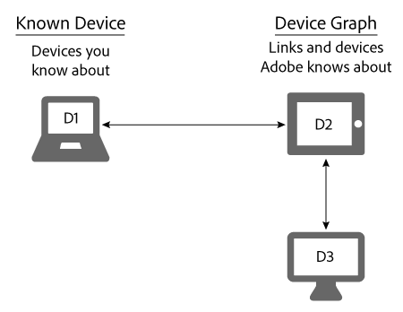

# Bekannte Geräte{#known-devices}

Über bekannte Geräte im Gerätediagramm.

Im Gerätediagramm haben wir das Konzept eines *`known device`*. Ein bekanntes Gerät ist ein Gerät, mit dem ein Kunde mit Ihrer Marke interagiert.

>[!NOTE]
>
>Im [!DNL Adobe Experience Cloud Device Co-op], Begriffe wie *`device`*, *`person`*, *`identity`* usw. spezifische Bedeutungen haben. &quot;Gerät&quot;kann beispielsweise auf physische Hardware wie ein Telefon oder Tablet und auf diese Hardware ausgeführte Anwendungen verweisen. Siehe [Glossar](../glossary.md#glossgroup-0f47d7fbd76c4759801f565f341a386c) für Definitionen.

## Unterstützen von Zielen mit dem bekannten Gerät {#section-80deae33660e4280ac65c659ceff5601}

Das bekannte Gerätekonzept unterstützt einige Ziele, die für die Erstellung und Pflege eines effektiven [!DNL Device Co-op] Programm. Ein bekanntes Gerät ist ein Gerät, das [!DNL Device Co-op] -Mitglied weiß von einer Interaktion mit einem Verbraucher (z. B. einem Site-Besuch oder der Verwendung einer mobilen App). Basierend auf diesen Aktionen wird die [!DNL Device Graph] verknüpft die bekannten Geräte eines [!DNL Device Co-op] Mitglied von Geräten, die von anderen [!DNL Device Co-op] Mitglieder. Diese Links können [deterministisch oder probabilistisch](../processes/links.md#concept-58bb7ab25f904f5f98d645e35205c931). Vorteile [!DNL Device Co-op] -Mitglieder, da sie empfangen:

* Weitere Daten zu ihren bekannten Geräten.
* Neue Informationen über andere verknüpfte Geräte.

Die [!DNL Device Graph] stellt keine Informationen zu Geräteclustern bereit, die ein Mitglied der Device Co-op nicht gesehen hat.

## Ziele der Device Co-op {#section-75aea5a102d54733aae2a7c6ee9ec6c7}

Drei Hauptziele animieren die [!DNL Device Co-op]. Dazu gehören:

* **Skalierung:** Geben Sie die maximale Anzahl möglicher Links für eine Vielzahl von Anwendungsfällen frei.
* **Fairness:** Stellen Sie sicher, dass jedes Mitglied der [!DNL Device Co-op] Leistungen in einer Weise gewährt werden, die ihren Beiträgen entspricht.

* **Verbrauchervertrauen:** Sie können das Vertrauen der Verbraucher wahren und stärken, indem Sie sicherstellen, dass die geräteübergreifende Erfahrung der Verbraucher Marken beinhaltet, die sie bereits kennen und denen sie vertrauen.

## Skalieren und bekanntes Gerät {#section-67f734109762457ca62ec306284ea082}

Die folgenden Methoden stellen die gängigeren Methoden dar, mit denen ein Gerät als bekanntes Gerät qualifiziert wird. Angesichts dieser Methoden [!DNL Device Co-op] -Mitglieder haben fast immer mindestens 1 bekanntes Gerät. Dies unterstützt das Ziel, allen Mitgliedern der [!DNL Device Co-op].

**Organisch**

* Vom Besuch eines Kunden auf Ihrer Site oder durch Verwendung Ihrer App. Dies ist eine Qualifizierung aus Erstanbieterdaten.
* Durch Onboarding von Kunden aus einem CRM-System.

**Marketplace**

* Kauf von Segmentdaten aus Audience Marketplace.
* Aus dem Kauf von Daten von einem Drittanbieter.

**Werbung**

Indem sie Inventar in einer Auktion gewinnen und eine Anzeige an ein Gerät senden. Das Gerät wird zu einem bekannten Gerät, wenn diese Anzeige eine [!DNL Audience Manager] Pixel.

## Bekannte Geräte und Fairness-Anwendungsfälle {#section-0543188729d845d6b95db70b8b25e9f8}

Mitglieder der [!DNL Device Co-op] Abrufen von Links entsprechend ihren Beiträgen zum [!DNL Device Graph]. Unternehmen, die viele Geräte zur [!DNL Device Graph] erhalten mehr Links als Mitglieder, die nur wenige beitragen. Wir glauben, dass dies dazu beiträgt, [!DNL Device Co-op] fair für alle Mitglieder. Sehen wir uns an, wie dies bei den unten beschriebenen großen und kleinen Anwendungsfällen funktioniert.

**Marke A: Großanwendungsfall**

In diesem Beispiel hat Marke A jeden Monat 100 Besucher und startet eine neue geräteübergreifende Markenkampagne. Zur Vereinfachung nehmen Sie die [!DNL Device Graph] weiß, dass alle Besucher von Marke A mit 1 zusätzlichem Gerät verknüpft sind. Das bedeutet, dass Marke A weitere 100 Geräte erreichen könnte. Darüber hinaus wird die [!DNL Device Graph] enthält etwa 200 miteinander verknüpfte Geräte.

<table id="table_78C38DC522F94BC38C1DB73740C058AC"> 
 <thead> 
  <tr> 
   <th colname="col1" class="entry"> Bekannte Geräte/Monat </th> 
   <th colname="col2" class="entry"> Verknüpfte Geräte, die von der Gerätekooperation empfangen wurden </th> 
   <th colname="col3" class="entry"> Geräte insgesamt für Campaign </th> 
  </tr>
 </thead>
 <tbody> 
  <tr> 
   <td colname="col1"> 
100 
 </td> 
   <td colname="col2"> 
100 
 </td> 
   <td colname="col3"> 
200 
 </td> 
  </tr> 
 </tbody> 
</table>

**Marke B: Anwendungsfall**

In diesem Beispiel hat Marke B jeden Monat 100 Besucher und startet eine neue geräteübergreifende Markenkampagne. Zur Vereinfachung nehmen Sie die [!DNL Device Graph] weiß, dass alle Besucher von Marke B mit 50 zusätzlichen Geräten verknüpft sind. Das bedeutet, dass Marke B 150 Geräte erreichen könnte. Darüber hinaus wird die [!DNL Device Graph] enthält etwa 1.000 miteinander verknüpfte Geräte.

<table id="table_A6C9CCF9C6564A89BA7060E075A8E73C"> 
 <thead> 
  <tr> 
   <th colname="col1" class="entry"> Bekannte Geräte/Monat </th> 
   <th colname="col2" class="entry"> Verknüpfte Geräte, die von der Gerätekooperation empfangen wurden </th> 
   <th colname="col3" class="entry"> Geräte insgesamt für Campaign </th> 
  </tr>
 </thead>
 <tbody> 
  <tr> 
   <td colname="col1"> 
100 
 </td> 
   <td colname="col2"> 
50 
 </td> 
   <td colname="col3"> 
150 
 </td> 
  </tr> 
 </tbody> 
</table>

>[!MORELIKETHIS]
>
>* [Unbekannte Geräte](../processes/unknown-device.md#concept-95090d341cdc4c22ba4319d79d8f6e40)

