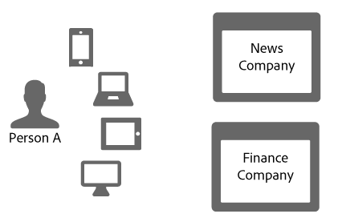
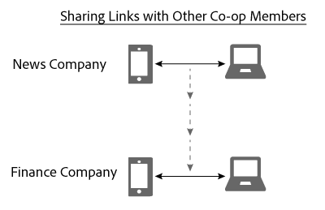

# Linkfreigabe im Gerätediagramm{#link-sharing-in-the-device-graph}

Informationen zur Linkfreigabe im Gerätediagramm.

Die [!DNL Device Graph] gibt deterministische und probabilistische Verknüpfungen mit verschiedenen Mitgliedern der Adobe Experience Cloud Device Co-op frei. Die Linkfreigabe ist das Ergebnis der [!DNL Device Co-op] so mächtig. Es erweitert, was jedes Mitglied über die Geräte weiß, die mit einer anonymen Person verbunden sind, aber nur, wenn Sie mindestens eines der Geräte dieser anonymen Person zuvor gesehen haben.

## Übersicht über Gerätediagramme {#section-7858e9f61b5644c981ffb53626fcc19d}

Bevor Sie beginnen, sollten wir uns kurz ansehen, wie die [!DNL Device Graph] funktioniert. Mitglieder der [!DNL Device Co-op] Daten an die [!DNL Device Graph]. Die [!DNL Device Graph] verwendet diese Daten, um die Identität einer Person aus [deterministische und probabilistische Verknüpfungen](../processes/links.md#concept-58bb7ab25f904f5f98d645e35205c931) zwischen Geräten. Als [!DNL Device Co-op] -Teilnehmer, bieten diese Links Einblicke in die Beziehung zwischen Ihren authentifizierten Benutzern, anderen Benutzern und ihren Geräten. Sehen wir uns im folgenden Abschnitt an, wie das funktioniert.

## Beispiel für Link-Freigabe {#section-cb410d827cf14f76bc9b0bd4d31ed767}

Das folgende Beispiel zeigt die Leistungsfähigkeit der Linkfreigabe in der Device Co-op. In diesem Beispiel haben wir 2 fiktive Unternehmen, die News Company und die Finance Company. Beide Unternehmen sind Mitglieder der [!DNL Device Co-op]. Person A ist ein Verbraucher, der sich auf mehreren Geräten von jedem Unternehmen aus anmeldet oder die Websites durchsucht.

Da sich Person A mit ihrem Mobiltelefon und Tablet bei der News-Website authentifiziert hat, identifiziert das News Company sie mit einer Kunden-ID. Diese ID wird an die [!DNL Device Graph] als kryptografischen Hash. Das Finanzunternehmen hat diese Geräte schon einmal gesehen, Person A hat sich jedoch nicht bei der Site angemeldet. Folglich weiß das Finanzunternehmen nicht, ob und wie diese Geräte miteinander in Beziehung stehen oder wie sie mit Person A verbunden sind.

Angesichts des kryptografischen Hash der Verbraucher-ID wird die [!DNL Device Graph] erkennt an, dass diese Geräte miteinander und mit einer bestimmten Person verbunden sind. Für Unternehmen, die nicht an der [!DNL Device Co-op] Diese Site-Besuche scheinen von separaten, zufälligen Geräten zu stammen. Auf jeden Fall muss die Variable [!DNL Device Graph] hat die Hash-ID:

* Weiß, dass Mobiltelefon und Laptop miteinander verbunden sind.
* erkennt an, dass das Finanzunternehmen wissen möchte, ob das Mobiltelefon und der Laptop miteinander verbunden sind.

Unter diesen Bedingungen wird die [!DNL Device Graph] gibt nun die Verbindung frei, die diese Geräte für das News-Unternehmen mit dem Finance Company verbindet. Während dieses Prozesses wird die [!DNL Device Graph] dupliziert und gibt den Link von einem Mitglied der Kooperation an ein anderes weiter.

An dieser Stelle wird die [!DNL Device Graph] ihre Rolle erfolgreich ausgeführt hat. Sowohl das Nachrichtenunternehmen als auch das Finanzunternehmen haben ein klares Bild einer Identität. Sie können Person A auf allen ihren Geräten genau erreichen.

## Datenschutz und Linkfreigabe {#section-7b566018b3304420a4b3e4c079826110}

Wahrung der Privatsphäre und Datenintegrität der Verbraucher [!DNL Device Co-op] -Mitglieder sind während des gesamten Linkteilungsprozesses von entscheidender Bedeutung. Während dieser Kundenidentifizierung und Linkfreigabe wird die [!DNL Device Graph] nicht:

* Teilen Sie dem Finanzunternehmen mit, dass der Link vom Nachrichtenunternehmen stammt.
* Freigeben der von einer verwendeten Kunden-ID [!DNL Device Co-op] Mitglied mit einem anderen Element.
* Geben Sie alle Informationen an, außer dass das Mobilgerät und der Laptop einen Link gemeinsam nutzen.

## Nächste Schritte {#section-ac6e61f1eb6e45b1bb4be8ece39147c7}

Das Lesen der Dokumentation zu Identität, Verknüpfung und Linkfreigabe sollte Ihnen einen guten Eindruck davon vermitteln, wie die [!DNL Device Graph] Assembliert Daten intern. Als nächsten Schritt empfehlen wir, sich unsere Dokumentation anzusehen, in der das Konzept eines *`known device`* stellt geräteübergreifende Links zu Mitgliedern der Device Co-op bereit. Siehe [Bekannte Geräte](../processes/known-device.md#concept-8e87c276819a48bfac5cef10b45216d1) und [Unbekannte Geräte](../processes/unknown-device.md#concept-95090d341cdc4c22ba4319d79d8f6e40).
