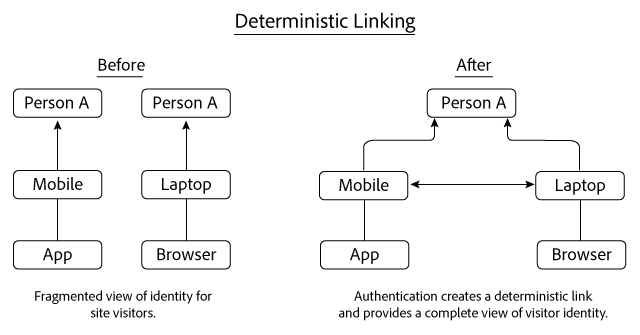
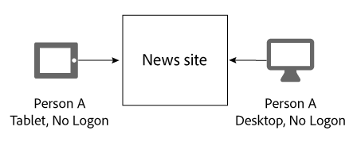
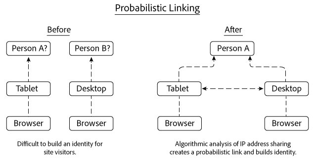
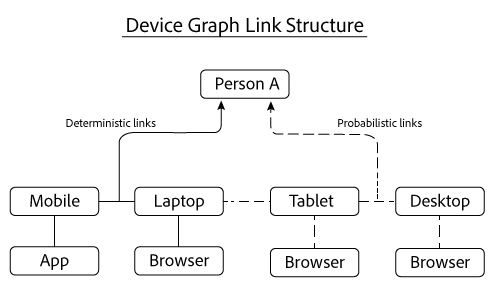

# Deterministische und probabilistische Verknüpfungen{#deterministic-and-probabilistic-links}

So analysiert das Gerätediagramm deterministische und probabilistische Daten, um eine Zuordnung zu erstellen, die Geräte miteinander verknüpft.

Im [!DNL Device Graph], erstellen interne Prozesse eine Identitätshierarchie, die Geräte zuordnet und sie mit einzelnen, anonymisierten Personen verbindet. Die Ausgabe des Diagramms enthält geräteübergreifende Links, die Sie für das Targeting verwenden können, sowie Daten, die in ausgewählten Experience Cloud-Lösungen verfügbar gemacht werden. Die Adobe-Lösungen, mit denen [!DNL Device Graph] zu den Daten gehören Analytics, Audience Manager, Media Optimizer und Target.

Die [!DNL Device Graph] analysiert deterministische und probabilistische Daten, um eine Karte zu erstellen, die Geräte miteinander verknüpft. Deterministische Daten verknüpfen Geräte anhand von Hash-Anmeldedaten miteinander. Probabilistische Daten verknüpfen Geräte anhand von Informationen wie IP-Adressen und anderen Metadaten miteinander. Die [!DNL Device Graph] verknüpft die verknüpften Gerätecluster mit einer anonymen Person. Diese Verbindungen ermöglichen es digitalen Marketingexperten, Personen anstelle von Geräten zu erreichen. Im [!DNL Device Graph], ist der Besitzer eines Geräts die anonyme Darstellung einer realen Person. Sowohl deterministische als auch probabilistische Verknüpfungen helfen beim Aufbau einer Struktur der Benutzeridentität.

>[!NOTE]
>
>In der Adobe Experience Cloud-Gerätekooperation können Begriffe wie *Gerät*, *person* und *identity* spezifische Bedeutungen haben. Beispiel: *Gerät* kann sich auf physische Hardware wie ein Telefon oder Tablet und auf die Anwendungen beziehen, die auf dieser Hardware ausgeführt werden. Siehe [Glossar](../glossary.md#glossgroup-0f47d7fbd76c4759801f565f341a386c) für Definitionen.

## Was sind Links? {#section-2df4c6f01eba49369993146df0661f13}

Wenn wir über Links sprechen, ist es wichtig zu bedenken, was diese wirklich im Kontext der [!DNL Experience Cloud] Gerätediagramm. In diesem Zusammenhang sind Links keine physischen Verbindungen zwischen Geräten. Stattdessen wird über einen Link ermittelt, wie das Gerätediagramm verschiedene Geräte derselben unbekannten Person zuordnet. Angenommen, wir haben ein Mobiltelefon und einen Desktop-Browser. Telefon und Browser können als &quot;verknüpft&quot;betrachtet werden, sobald das Gerätediagramm feststellt, dass beide Geräte von derselben unbekannten Person verwendet werden. Wie Sie unten lesen werden, erstellt das Gerätediagramm Identitäten mit deterministischen und probabilistischen Links. Und im Gerätediagramm ist der Besitzer eines Geräts die anonyme Darstellung einer realen Person.

## Deterministische Verknüpfungen {#section-33d41e828a674b398e36fe63da20ac09}

Deterministische Verknüpfungen verknüpfen ein Gerät basierend auf einem Authentifizierungsereignis mit einer Person (z. B. eine Anmeldeaktion von einem Gerät zu einer Site). Diese Aktion erstellt eine anonymisierte Kennung, die als Verbraucher-ID bezeichnet wird. Sehen wir uns einmal an, wie deterministische Verknüpfungen funktionieren. In diesem Beispiel meldet sich Person A über eine App auf ihrem Mobilgerät bei einer Nachrichten-Site an. Später an diesem Tag meldet sich Person A erneut an, aber diesmal über einen Browser auf ihrem Laptop.

Basierend auf den Anmeldedaten, das Gerätediagramm:

* Weist nach, dass Person A sich mit einer Kombination aus Mobiltelefon/App und Laptop/Browser-Gerät bei der News-Website authentifiziert hat.
* Verknüpft diese Geräte mit Person A.
* Erstellt eine Identität basierend auf verknüpften Geräten, die mit einer anonymen Person verknüpft sind.

>[!NOTE]
>
>Weder [!DNL Adobe Experience Cloud Device Co-op] oder [!DNL Device Graph] empfängt in diesen Daten tatsächliche Authentifizierungsinformationen oder persönlich identifizierbare Informationen (PII). Mitglieder der [!DNL Experience Cloud Device Co-op], übergeben kryptografische Hash-eindeutige Kunden-IDs an das Gerätediagramm. Die Verbraucher-ID stellt einen authentifizierten Benutzer im Diagramm dar und schützt die Privatsphäre der Verbraucher.

## Probabilistische Links {#section-5f5aa755da984f9d851f7cb380262998}

Probabilistische Verknüpfungen verbinden ein Gerät anhand von Merkmalen und Metadaten wie:

* Browsing-Verhalten
* IP-Adressen
* Betriebssysteme
* IDFA- und GAID-Kennungen

Sehen wir uns an, wie probabilistische Verknüpfungen funktionieren. In diesem Beispiel navigiert Person A auf dem Tablet zu einer Nachrichten-Site und später von einem Desktop-Computer. Während des Browsers meldet sich Person A nicht bei der News-Site an. Bei jedem separaten Besuch verwenden Tablet und Desktop dieselbe IP-Adresse.

Anhand dieser Informationen wird die [!DNL Device Graph] wertet die IP-Adressenfreigabe-Muster zwischen beiden Geräten aus und verknüpft diese Geräte miteinander, wenn die Ergebnisse darauf schließen lassen, dass sie zu Person A gehören. Das Endergebnis ist eine Hierarchie der Identität, die aus algorithmischen Wahrscheinlichkeitsberechnungen abgeleitet wird.

In diesem Beispiel verknüpfte das Gerätediagramm beide Geräte, nachdem sie für den Zugriff auf dieselbe News-Site verwendet wurden. Geräte müssen jedoch nicht auf derselben Website angezeigt werden, um verknüpft zu werden. Um diesen Punkt zu veranschaulichen, nehmen wir an, dass jedes Gerät in diesem Beispiel völlig verschiedene Websites besucht. Die [!DNL Device Graph] -Algorithmus kann weiterhin eine probabilistische Verknüpfung basierend auf ihrer freigegebenen IP-Adresse und aus einer Analyse anderer Daten herstellen. Dieser Prozess hilft, probabilistische Verknüpfungen für Mitglieder der [!DNL Experience Cloud] Gerätekooperation.

## Beide Datentypen bieten einen Wert {#section-43d22d8c10634edcb261e7bda6fdf323}

Deterministische und probabilistische Daten ergänzen sich gegenseitig. Im Gegensatz dazu bietet Ihnen ein Gerätediagramm, das nur deterministische Daten enthält, eine eingeschränkte Sicht auf die Identität einer Person. Ohne Authentifizierung kann ein Gerätediagramm nicht über andere Geräte und Personen informieren, die Ihre Site durchsuchen. Probabilistische Daten können diese Verbindungen herstellen und Ihnen dabei helfen, nicht authentifizierte Geräte, Personen und Haushalte zu erreichen.

Deterministische Daten sind jedoch auch wichtig. So kann beispielsweise die probabilistische Entscheidungsfindung verbessert werden, indem falsche Verknüpfungen entfernt werden, die an Orten erzeugt werden, an denen probabilistische Signale reichlich und überlappend sind (z. B. Cafés, Bibliotheken, Flughäfen usw.).

Mit beiden Datentypen liefert Ihnen das Gerätediagramm ein umfassenderes Bild der Identität einer Person als mit beiden Typen allein.

